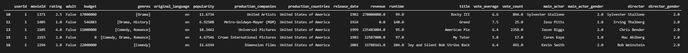
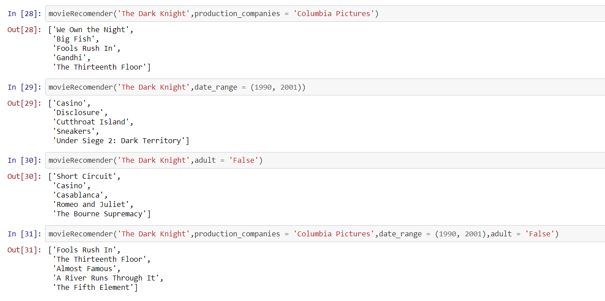
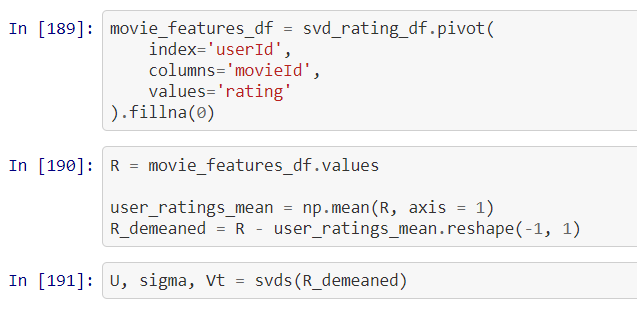
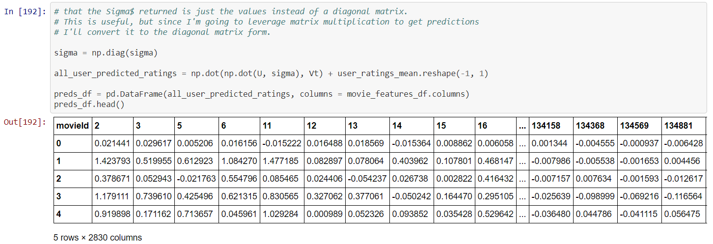
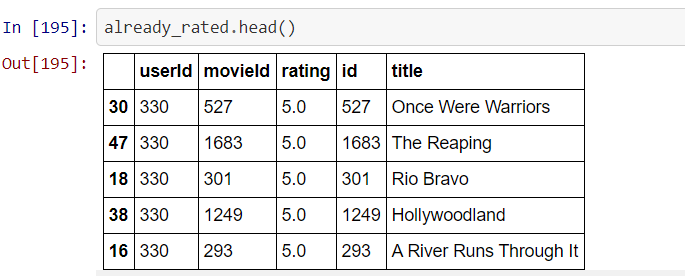
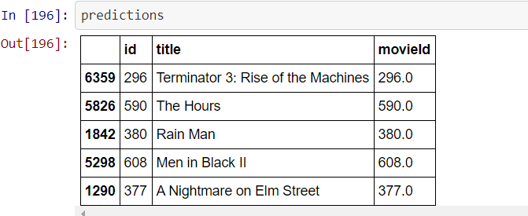
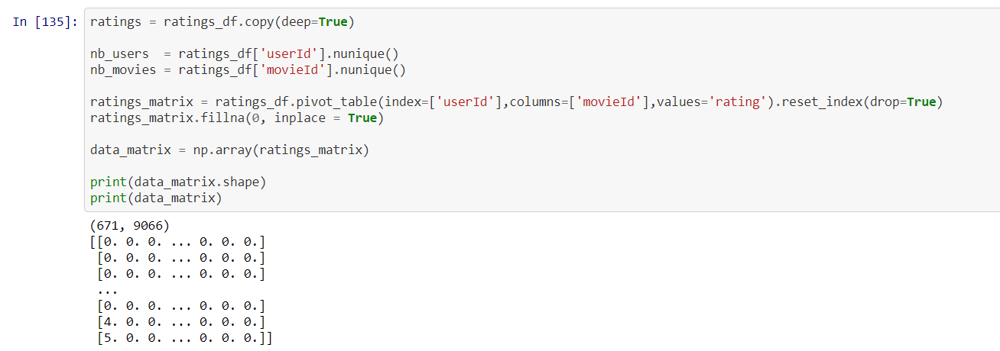
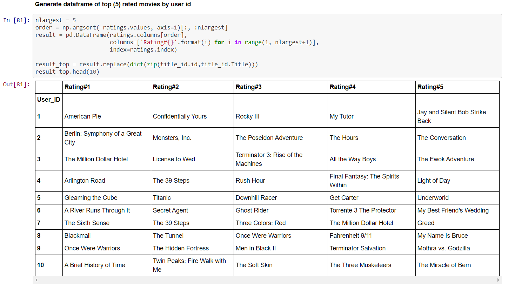
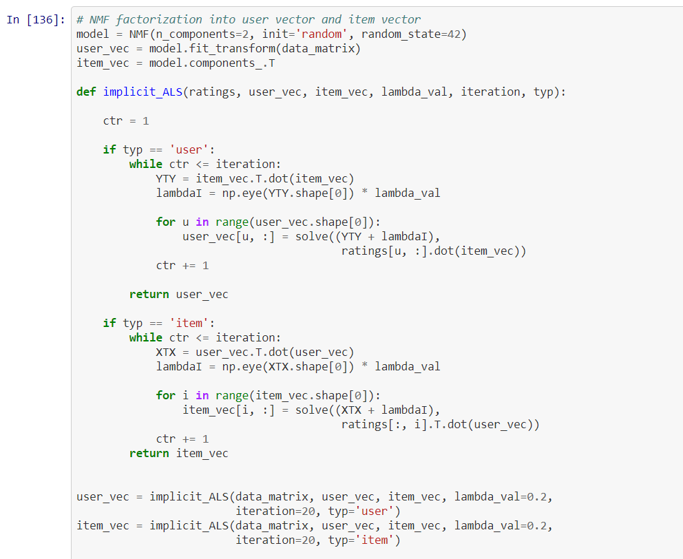
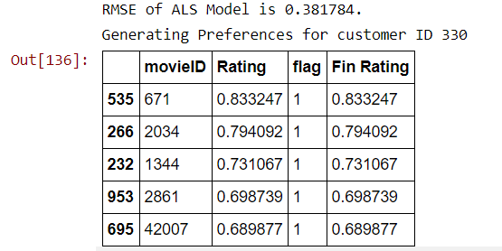

# Project_3
Recommending a Movie Recommender System using different techniques like correlation matrix, machine learning SVD (Singular Value Decomposition) and ALS (Alternating Least Squre) method.
# Group 3 Project-3 (UofT FinTech Bootcamp)


__Title__: Recommender System using three different techniques and their comparison<br />
__Group members__: Amar M, Nitesh Jain, Sinthushan Sooriyakuamar, Veldurai Lakshmanan <br />

## 1. Introduction of the Project

Most internet products we use today are powered by recommender systems. Youtube, Netflix, Amazon, Facebook, and long list of other internet products all rely on recommender systems to filter millions of content and make personalized recommendations to their users. Recommender systems are well-studied and proven to provide tremendous values to internet businesses and their consumers. Recommender systems can be loosely broken down into three categories: content based systems, collaborative filtering systems, and hybrid systems (which use a combination of the other two).


Content based approach utilizes a series of discrete characteristics of an item in order to recommend additional items with similar properties.


Collaborative filtering approach builds a model from a user’s past behaviors (items previously purchased or selected and/or numerical ratings given to those items) as well as similar decisions made by other users. This model is then used to predict items (or ratings for items) that the user may have an interest in.

Hybrid approach combines the previous two approaches. Most businesses probably use hybrid approach in their production recommender systems.

This project tries to touch on all three techniques.

### 1.1 Technical Tools Used

| Tool | Details |
| ---- | ------- |
| Language | Python 3.0 implemented through Jupyter Notebook |
| Libraries |  Data preparation and Visualization: Pandas, Surprise, SciKit Learn, Numpy and Seaborn  |


### 1.2 Related Files

[Movie Recommender ipynb File](Group_3_Project_3_Movie_Recommendation.ipynb)

[Credits CSV File](Data/credits.csv)  

[Movies Database CSV File](Data/movies_metadata.csv)  

[Ratings small CSV File](Data/ratings_small.csv)  


### 1.3 Data sources and preparation

The movie data was downloaded from the open source TMDB (The Movie Database), which contains 45,000 movies information along with their ratings. The various CSV files used are marked in the files above. The various files were cleaned by removing the "null" values and were combined to form combined_df. 

The following piece of code was used to create 2 new columns for production_countries and production_companies.

````
from ast import literal_eval
production_countries = []
production_companies = []
for index, row in movies_df.iterrows():
    try:
        production_countries.append(literal_eval(movies_df['production_countries'][index])[0]['name'])
    except:
        production_countries.append(None)
    try:
        production_companies.append(literal_eval(movies_df['production_companies'][index])[0]['name'])
    except:
        production_companies.append(None) 
movies_df['production_countries'] = production_countries
movies_df['production_companies'] = production_companies

````
Similarly, to make the data more useful for making recommendations, the gender of the main actor and the director were added to the main dataframe.

````
main_actor = []
main_actor_gender = []

for cast in credits_df['cast']:
    try:
        main_actor.append(literal_eval(cast)[0]['name'])
        main_actor_gender.append(literal_eval(cast)[0]['gender'])
    except:
        main_actor.append(None)
        main_actor_gender.append(None)
credits_df['main_actor'] = main_actor
credits_df['main_actor_gender'] = main_actor_gender
````


The Main dataframe looks like this.



## 2. Generating Recommendations
Once the dataframe is ready, it can used to generate recommendations based on certain parameters.


### 2.1 Generating Recommendations through Correlation Matrix
To start, we first made a DataFrame which consists of titles as its column and userId as its rows with the values of the DataFrame being the ratings of each viewer.
The reason why we did this was mainly due to the nature of the corrwith() function.  The corrwith() function,using the Pearson correlation coefficients, can calculate the similarity between two DataFrame columns. Thus, we want the movie titles as columns so that we can take one column (which represents one movie) and compare it with the others. We also need to have user ratings as the values of our DataFrame because our final goal is to compare the similarity between how each user rated the different movies, and then use the highest similarities to suggest movie recommendations.

Our algorithm begins by finding the correlation between our first inputted movie and the first movie column in the movies DataFrame. Then it repeats this process for all of the movie titles in the movies DataFrame — in other words, we’ll repeat this process for every movie in our MovieLens dataset. It is to be noted that the Pearson correlation coefficient is the default correlation method for pandas’ corrwith() function, so technically it is not required to have put method = 'pearson' at the end of the code.

Sample Output of the Correlation Matrix.



Few errors while running the Correlation Matrix.


### 2.2 Generating Recommendations through Singular Value Decomposition (SVD) Method
The Singular Value Decomposition (SVD), a method from linear algebra that has been generally used as a dimensionality reduction technique in machine learning. SVD is a matrix factorisation technique, which reduces the number of features of a dataset by reducing the space dimension from N-dimension to K-dimension (where K < N). 
In the context of the recommender system, the SVD is used as a collaborative filtering technique. It uses a matrix structure where each row represents a user, and each column represents an item. The elements of this matrix are the ratings that are given to items by users.

The factorisation of this matrix is done by the singular value decomposition. It finds factors of matrices from the factorisation of a high-level (user-item-rating) matrix.The essence of SVD is that it decomposes a matrix of any shape into a product of 3 matrices with nice mathematical properties: A=USVT.
By lucid analogy, a number can decompose into 3 numbers to always have the smallest prime in the middle. E.g 24=3×2×4 or 57=1×3×19.

The data was collated by synchronising the data types.
````
# Clean the data


svd_movies_df = movies_df[['id', 'title']]
svd_movies_df.dtypes

svd_rating_df = ratings_df[['userId', 'movieId','rating']]
svd_rating_df.dtypes

````
A feature matrix was created on which the SVD algo could be applied.



This matrix was used to create prediction table.



Based on the movies that were rated by a user, new recommendations were made by the algo. Depending upon the user's rating to different movies, a list of recommendations is made to the user through a function.

Movies Already rated by the user


Predictions made by the algo based on user's previously rated movies.




### 2.3 Generating Recommendations through Alternating Least Square (ALS) Method

Collaborative Filtering algorithm is one of the popular successful techniques of RS, which aims to find users closely similar to the active one in order to recommend items. Collaborative filtering (CF) with alternating least squares (ALS) algorithm is the most imperative techniques which are used for building a movie recommendation engine. The ALS algorithm is one of the models of matrix factorization related CF which is considered as the values in the item list of user matrix. As there is a need to perform analysis on the ALS algorithm by selecting different parameters which can eventually help in building efficient movie recommender engine.

Spark MLlib library for Machine Learning provides a Collaborative Filtering implementation by using Alternating Least Squares. The implementation in MLlib has these parameters:

1. numBlocks is the number of blocks used to parallelize computation (set to -1 to auto-configure).
2. rank is the number of latent factors in the model.
3. iterations is the number of iterations to run.
4. lambda specifies the regularization parameter in ALS.
5. implicitPrefs specifies whether to use the explicit feedback ALS variant or one adapted for implicit feedback data.
6. alpha is a parameter applicable to the implicit feedback variant of ALS that governs the baseline confidence in preference observations.

First, the ratings matrix was created.


A dataframe for top five movies (rated by the user) was created.


Then, an implicit_ALS function was created.


And also, a prediction function was created.


The ALS functions were measured using the standard test and an RMSE score of 0.4713 was achieved along with the prediction of movies.



## 3. Conclusion and Possible Improvements

There is no clear winner to design a recommender system and it depends vastly on the project requirements and the resources at hand. We tried to build three different models using three different hypothesis and each has its own applicability. Few areas that can be looked at are:-
1. The recommendation based on movies in different languages also.
2. The recommendations based on sequels, which share the same/ similar names. Even the movies with names or keywords containing synonyms can be looked at using Natural Language Processing (NLTK) library.
3. Another recommendation could be from actors or directors having worked in different movies. 

## 4. References
 1. https://towardsdatascience.com/prototyping-a-recommender-system-step-by-step-part-1-knn-item-based-collaborative-filtering-637969614ea
 2. https://www.kaggle.com/rounakbanik/movie-recommender-systems
 3. https://www.kaggle.com/fabiendaniel/film-recommendation-engine
 4. https://towardsdatascience.com/prototyping-a-recommender-system-step-by-step-part-2-alternating-least-square-als-matrix-4a76c58714a1
 5. https://towardsdatascience.com/build-recommendation-system-with-pyspark-using-alternating-least-squares-als-matrix-factorisation-ebe1ad2e7679
 6. https://medium.com/analytics-vidhya/simple-movie-recommender-system-with-correlation-coefficient-with-python-e6cb31dae01e
 7. https://towardsdatascience.com/recommender-system-singular-value-decomposition-svd-truncated-svd-97096338f361#:~:text=Recommending%20movies%20using%20SVD,features%20of%20item%2Duser%20matrices
8. https://www.kaggle.com/subhamoybhaduri/diff-approaches-of-building-recommender-system


